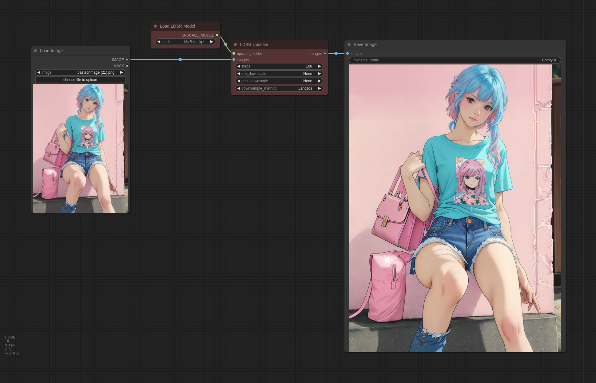

# ComfyUI-Flowty-LDSR

This is a custom node that lets you take advantage of Latent Diffusion Super Resolution (LDSR) models inside ComfyUI.

LDSR models have been known to produce significantly better results then other upscalers, but they tend to be much slower and require more sampling steps. Results may also vary based on the input image.


|  |  |
|--------------------------------|---------------------------------|

I've created this node for experimentation, feel free to submit PRs for performance improvements etc.

### Installation:
* Install ComfyUI
* Clone this repo into ```custom_nodes```:
  ```shell
  $ cd ComfyUI/custom_nodes
  $ git clone https://github.com/flowtyone/ComfyUI-Flowty-LDSR.git
  ```
* Install dependencies:
  ```shell
  $ cd ComfyUI-Flowty-LDSR
  $ pip install -r requirements.txt
  ```
* [Download LDSR](https://heibox.uni-heidelberg.de/f/578df07c8fc04ffbadf3/?dl=1) and place it in ```ComfyUI/models/upscale_models```
* Start ComfyUI (or restart)

### Workflow:




This is a community project from [flowt.ai](https://flowt.ai). If you like it, check us out!

<picture>
 <source media="(prefers-color-scheme: dark)" srcset="logo-dark.svg" height="50">
 <source media="(prefers-color-scheme: light)" srcset="logo.svg" height="50">
 
</picture>